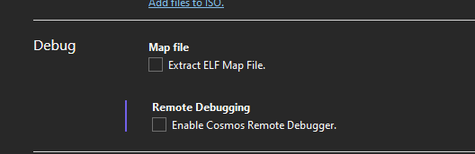

An hobby operating system built on [Cosmos](https://github.com/CosmosOS/Cosmos)

## current features

- fully functional port of [bunnysay](https://github.com/Bizzerowasnotavailable/bunnysay)
- echo
- system information fetch program
- cp mv and ls
- user system
- FAT filesystem
- rm command
- lua interpreter (ported from [AuraOS](https://github.com/aura-systems/Aura-Operating-System))

## compiling instructions

- download [Cosmos and all the dependencies](https://github.com/CosmosOS/Cosmos)
- build as "Debug"
- if the ISO doesn't boot outside of vmware, disable "Remote debugging" in "Debug" > "shinx debug properties"

### 100% made in italy, shoutout to hirpus lab

