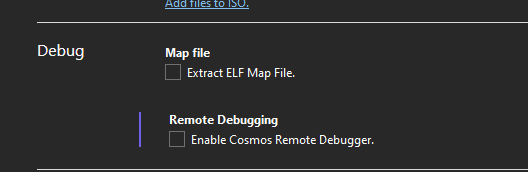

An hobby operating system built on [Cosmos](https://github.com/CosmosOS/Cosmos)

## current features

- fully functional port of [bunnysay](https://github.com/Bizzerowasnotavailable/bunnysay)
- echo
- system information fetch program
- cp mv and ls
- user system
- FAT filesystem
- rm command
- lua interpreter (ported from [AuraOS](https://github.com/aura-systems/Aura-Operating-System))
- Desktop environment (based on [CrystalOS](https://github.com/CrystalOSDevelopment/CrystalOS))

## compiling instructions

### Cosmos' official Userkit is 3 years out of date!!
- download [OUR UserKit](https://github.com/Bizzerowasnotavailable/Shinx/raw/refs/heads/refactor/devkit/Tools/CosmosUserKit-20260326-vs2022.exe)
- download [all the dependencies](https://github.com/CosmosOS/Cosmos) except the Cosmos userkit
- build as "Debug"
- if the ISO doesn't boot outside of vmware, disable "Remote debugging" in "Debug" > "shinx debug properties"

### 100% made in italy, shoutout to hirpus lab

